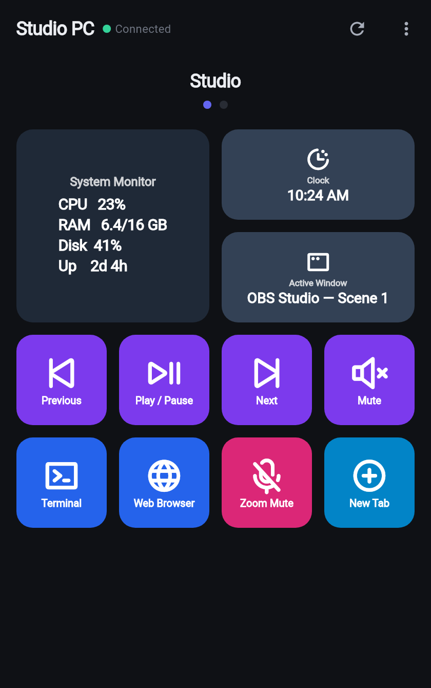
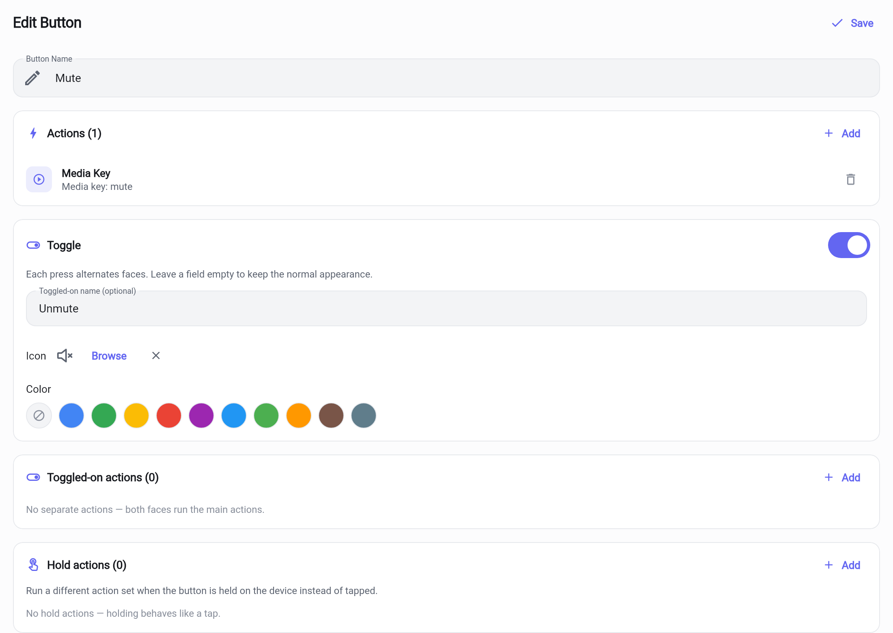

# MarcoDeck - Open Source Touch Portal Alternative

<p align="center">
  
</p>

<p align="center">
   <strong>An open-source alternative to Touch Portal, built with Flutter</strong>
</p>

<p align="center">
  <a href="#-download">Download</a> •
  <a href="#-features">Features</a> •
  <a href="#️-getting-started">Getting Started</a> •
  <a href="#-usage">Usage</a> •
  <a href="#-plugins">Plugins</a> •
  <a href="#-contributing">Contributing</a>
</p>

---

## 📸 Screenshots

<p align="center">
  
  &nbsp;&nbsp;
  
</p>
<p align="center"><sub>The phone client with live tiles (left) and the server's button editor configuring a Mute/Unmute toggle (right).</sub></p>

## 📥 Download

Grab the latest build from the [**Releases**](https://github.com/lohanidamodar/macro-deck-updated/releases) page:

| Platform | Download |
|----------|----------|
| **Windows** (server) | `MarcoDeck-Setup-x.y.z.exe` (installer) or `MarcoDeck-windows-portable.zip` |
| **Linux** (server) | `MarcoDeck-linux.tar.gz` |
| **Android** (client) | `MarcoDeck-client.apk` |
| **macOS / iOS / Web** | [build from source](#-installation) |

> The desktop **server** runs your macros; the mobile/web **client** is the remote control. You need both.

Releases are cut automatically when a `vX.Y.Z` tag is pushed.

## 🚀 Features

### Core Functionality
- **Dual Architecture**: Server runs on desktop (Windows, macOS, Linux), client on mobile (Android, iOS) and web
- **WebSocket Communication**: Real-time, reliable communication between server and client
- **UDP Auto-discovery**: Phones find servers on the LAN automatically (manual entry still available)
- **Custom Macro Buttons**: Commands, keystrokes, media keys, open URL, type/prompt text, focus a window, switch page, and plugin actions
- **Multi-Page Support**: Organize buttons across reorderable pages with variable tile sizes
- **Cross-Platform**: Works seamlessly across all major platforms

### 🎛️ Buttons, Tiles & Presets
- **Built-in catalog**: Drop-in, cross-platform buttons grouped into Media, System, Apps, Web, Window, Clipboard and Navigation — no setup needed
- **Toggle buttons**: Two-state buttons (e.g. Mute/Unmute) with a separate name, icon, color and action set per face — the active face is persisted and synced live to every device
- **Hold actions**: A button can run a different action set when long-pressed on the device
- **Multi-action sequences with delays**: Chain several actions on one button and insert pauses (up to 60 s) between steps
- **Live tiles**: Show live system info on a tile (CPU, RAM, disk, uptime, clock, battery, network) and any plugin-streamed state
- **Full-page picker**: Searchable, category-filtered grid; multi-select to add several buttons at once
- **Test on the desktop**: Run a button on the server (no client needed) to verify it
- **Client controls a real device**: Adjustable tile sizes, drag-to-reorder, dynamic "prompt" buttons, jump-to-page navigation tiles
- **Profile backup**: Export/import the entire button & page configuration as a JSON file

### 🎨 Enhanced UI/UX
- **Material Design 3**: Modern, consistent design language across all platforms
- **Smooth Animations**: Fluid transitions and responsive animations
- **Dark/Light Themes**: Automatic system theme detection with manual override
- **Responsive Design**: Optimized for different screen sizes and orientations
- **Fullscreen & Orientation**: Immersive fullscreen mode plus portrait/landscape/auto orientation on the client
- **Haptic Feedback**: Tactile feedback for better user interaction on mobile devices

### ♿ Accessibility Features
- **High Contrast Themes**: Enhanced visibility for users with visual impairments
- **Text Scaling**: Adjustable text size from 80% to 200%
- **Reduced Motion**: Option to minimize animations for motion-sensitive users
- **Screen Reader Support**: Full compatibility with accessibility services
- **Semantic Navigation**: Proper focus management and keyboard navigation
- **Haptic Feedback Levels**: Multiple intensity levels for different interactions

### 🔐 Security
- **PIN Pairing**: Optionally require a 6-digit PIN before a device can connect — unpaired clients can't run actions or see your pages
- **Client Management**: Disconnect a client or block its IP from the dashboard

### 🌐 Network Reliability
- **Advanced Reconnection**: Exponential backoff with jitter for robust connection recovery
- **Health Monitoring**: Continuous connection health checks with ping/pong protocol
- **Connection Verification**: Timeout-based connection establishment verification
- **Adaptive Retry Logic**: Smart retry mechanisms with configurable limits
- **Real-time Status**: Live connection status indicators throughout the interface
- **LAN Discovery**: Multicast + broadcast announcements so clients can join with one tap

### 🖥️ Server Features
- **Real-time Dashboard**: Live view of connected clients and server status
- **Button Management**: Visual button editor with drag-and-drop reordering
- **Command Execution**: Support for shell commands, keystrokes, and preset actions
- **Multi-Client Support**: Handle multiple connected clients simultaneously
- **System Tray Integration**: Minimize to system tray for background operation

## 🖥️ Platform Support

| Capability | Windows | macOS | Linux |
|---|---|---|---|
| Shell commands / open URL / apps | ✅ | ✅ | ✅ |
| Keystrokes & typed text | ✅ (Win32) | ✅ ¹ | ✅ ² (X11, `xdotool`) |
| Media transport keys | ✅ (native VKs) | ✅ (controls Music & Spotify) | ✅ (`playerctl`) |
| Volume / mute | ✅ | ✅ | ✅ (`pactl`) |
| Window snapping presets | ✅ (Win-key) | Cmd shortcuts + Mission Control | ✅ (GNOME Super-key) |
| Select Window (focus) | ✅ | — | — |
| System live tiles (CPU/RAM/…) | ✅ | ✅ | ✅ |
| Active Window live tile | ✅ | ✅ ¹ | ✅ ² (X11) |
| OBS plugin | ✅ (bundled binary) | ✅ ³ | ✅ (bundled binary) |
| System tray | ✅ | ✅ | ✅ (AppIndicator) |

> ¹ macOS asks once for **Accessibility** permission (System Settings → Privacy & Security) the first time a keystroke/typing action runs.
> ² Keystroke and typing actions need `xdotool` and an X11 session (on Wayland, install `xdotool` and run the target apps under XWayland, or use commands instead). Media transport needs `playerctl`.
> ³ When building from source the OBS plugin runs with your Dart SDK automatically; release bundles ship a compiled standalone binary.

## 🛠️ Getting Started

### Prerequisites
- **Flutter SDK** (>=3.44.0) - [Installation Guide](https://flutter.dev/docs/get-started/install)
- **Dart SDK** (included with Flutter)
- **Platform-specific tools**:
  - Android: Android Studio & SDK
  - iOS: Xcode (macOS only)
  - Desktop: Platform-specific build tools

### Quick Start

1. **Clone the repository**
   ```bash
   git clone https://github.com/lohanidamodar/macro-deck-updated.git
   cd macro-deck-updated
   ```

2. **Install dependencies**
   ```bash
   flutter pub get
   ```

3. **Run the desktop server** (choose your platform)
   ```bash
   # Windows example
   flutter run -d windows -t lib/src/server/main.dart

   # macOS / Linux
   flutter run -d macos -t lib/src/server/main.dart
   flutter run -d linux  -t lib/src/server/main.dart
   ```

4. **Run the client** (mobile or web)
   ```bash
   # Android / iOS
   flutter run -d android -t lib/src/client/main.dart
   flutter run -d ios     -t lib/src/client/main.dart

   # Web
   flutter run -d chrome  -t lib/src/client/main.dart
   ```

5. *(Optional)* **Run build verification script** to ensure toolchains are healthy
   ```bash
   chmod +x build_verification.sh
   ./build_verification.sh
   ```

## 📱 Installation

### Building from Source

#### Desktop Server
```bash
# Windows
flutter build windows --release -t lib/src/server/main.dart

# macOS
flutter build macos --release -t lib/src/server/main.dart

# Linux
flutter build linux --release -t lib/src/server/main.dart
```

**Windows installer** (optional): with [Inno Setup](https://jrsoftware.org/isinfo.php)
installed, package the Windows build into a Setup `.exe`:
```bash
"C:\Program Files (x86)\Inno Setup 6\ISCC.exe" /DMyAppVersion=1.0.0 windows\installer\marcodeck.iss
# -> windows/installer/output/MarcoDeck-Setup-1.0.0.exe
```

#### Mobile Client
```bash
# Android
flutter build apk --release

# iOS (requires macOS and Xcode)
flutter build ios --release
```

#### Web Client
```bash
flutter build web --release
```

## 🎯 Usage

### Setting Up the Server

1. **Launch the server application** on your desktop computer
2. **Start the server** by clicking the "Start Server" button
3. **Note the connection URL** displayed (e.g., `ws://192.168.1.100:8080`)
4. **Configure buttons** using the button editor interface
5. **Create pages** to organize your buttons logically

### Connecting the Client

1. **Launch the client application** on your mobile device or web browser
2. **Use auto-discovery** (the Discover tab) or manually enter the URL from your server
3. **Connect to the server** - the app will automatically reconnect if connection is lost
4. **Use your macro buttons** by tapping them on the client interface

### Creating Macro Buttons

1. **Open the server application**
2. **Navigate to the button management section**
3. **Click "Add Button"** to create a new macro button
4. **Configure the button**:
   - Set a name and choose an icon
   - Select a color theme
   - Add actions (commands, keystrokes, or presets)
5. **Save the button** - it will immediately appear on connected clients

## 🧩 Plugins

MarcoDeck supports a **plugin system** so developers can add new actions and live
data **without modifying or recompiling the app** — the same out-of-process model
used by Stream Deck and Touch Portal.

A plugin is a folder with a `manifest.json` and an executable written in **any
language**. The server launches it and talks to it over a local WebSocket using a
small JSON protocol. Plugins can:

- add **configurable actions** (native-rendered settings fields),
- supply **dynamic option lists** at runtime,
- expose **global settings**, and
- stream **live state** that appears on the phone as a live tile (title or icon).

Install a plugin by dropping its folder into the plugins directory (server →
**Plugins → Open plugins folder**), pressing **Rescan**, and enabling it.

An **OBS Studio** plugin ships built-in (switch scenes, toggle recording/streaming,
live status tiles) — just enable it in **Plugins** and point it at your OBS
WebSocket server. Enabled plugins can also contribute ready-made buttons that
show up in the add-button picker.

- Protocol & manifest reference: [`docs/plugins/protocol.md`](docs/plugins/protocol.md)
- Bundled OBS plugin: [`assets/plugins/obs/`](assets/plugins/obs/)
- Minimal example: [`examples/plugins/hello_dart/`](examples/plugins/hello_dart/)

## ♿ Accessibility

MarcoDeck is designed to be accessible to all users:

### Visual Accessibility
- **High Contrast Mode**: Enhanced color contrast for better visibility
- **Text Scaling**: Adjustable text size for users with visual impairments
- **Clear Focus Indicators**: Visible focus states for keyboard navigation

### Motor Accessibility
- **Haptic Feedback**: Tactile confirmation of button presses
- **Large Touch Targets**: Appropriately sized interactive elements
- **Reduced Motion**: Optional animation reduction for motion-sensitive users

### Cognitive Accessibility
- **Clear Labels**: Descriptive text for all interface elements
- **Consistent Layout**: Predictable interface organization
- **Screen Reader Support**: Full compatibility with assistive technologies

### Enabling Accessibility Features
1. Open **Settings** in the client application
2. Navigate to the **Accessibility** section
3. Enable desired features:
   - High Contrast Mode
   - Reduce Animations
   - Adjust Text Size

## 🏗️ Architecture

### Project Structure
```
lib/
├── main.dart                 # Platform detection and app entry point
├── src/
│   ├── client/              # Mobile/web client application
│   │   ├── main.dart        # Client entry point
│   │   ├── splash_screen.dart
│   │   ├── buttons_screen.dart
│   │   ├── button_grid.dart
│   │   ├── connection_screen.dart
│   │   ├── settings_screen.dart
│   │   └── client_providers.dart
│   ├── server/              # Desktop server application
│   │   ├── main.dart        # Server entry point
│   │   ├── server.dart      # Core server logic
│   │   ├── server_screen.dart
│   │   ├── button_manager.dart
│   │   └── command_executor.dart
│   ├── models/              # Shared data models
│   │   ├── button.dart
│   │   ├── message.dart
│   │   ├── client_info.dart
│   │   └── server_connection.dart
│   ├── network/             # Network communication
│   │   ├── websocket_service.dart
│   │   ├── websocket_service_io.dart
│   │   └── websocket_service_web.dart
│   └── utils/               # Utilities and helpers
│       ├── theme.dart
│       ├── accessibility.dart
│       ├── logger.dart
│       ├── platform_utils.dart
│       └── system_tray_manager.dart
```

### Communication Protocol
The application uses WebSocket communication with a JSON-based message protocol:

- **Connection Management**: `connect`, `connectAck`, `ping`, `pong`
- **Button Operations**: `getButtons`, `buttonsResponse`, `buttonPress`
- **Command Results**: `commandResult`, `error`
- **Configuration**: `updateButton`, `pagesResponse`

## 🔧 Development

### Running in Development Mode
```bash
# Hot reload for client development
flutter run -d android --hot

# Debug server on desktop
flutter run -d windows --debug
```

### Testing
```bash
# Run unit tests
flutter test

# Run integration tests
flutter test integration_test/

# Analyze code quality
flutter analyze
```

### Build Verification
Use the included build verification script to test cross-platform compatibility:
```bash
./build_verification.sh
```

## 🤝 Contributing

We welcome contributions! Here's how you can help:

1. **Fork the repository**
2. **Create a feature branch** (`git checkout -b feature/amazing-feature`)
3. **Commit your changes** (`git commit -m 'Add amazing feature'`)
4. **Push to the branch** (`git push origin feature/amazing-feature`)
5. **Open a Pull Request**

### Development Guidelines
- Follow the existing code style and conventions
- Add tests for new features
- Update documentation as needed
- Ensure accessibility compliance
- Test across multiple platforms
- Read the [Code of Conduct](CODE_OF_CONDUCT.md) before participating

### Responsible Security Disclosure
Please do not open public issues for security reports. See [SECURITY.md](SECURITY.md) for responsible disclosure instructions.

## 📄 License

This project is distributed under the **BSD 3-Clause License**. See [LICENSE](LICENSE) for the full text.

## 🙏 Acknowledgments

- **Flutter Team** for the amazing cross-platform framework
- **Community Contributors** for feedback and improvements
- **Accessibility Advocates** for guidance on inclusive design
- **Stream Deck** for inspiration on macro control interfaces

## 📞 Support

- **Issues**: [GitHub Issues](https://github.com/lohanidamodar/macro-deck-updated/issues)
- **Discussions**: [GitHub Discussions](https://github.com/lohanidamodar/macro-deck-updated/discussions)
- **Documentation**: [Wiki](https://github.com/lohanidamodar/macro-deck-updated/wiki)

---

<p align="center">
  Made with ❤️ by the MarcoDeck community
</p>
